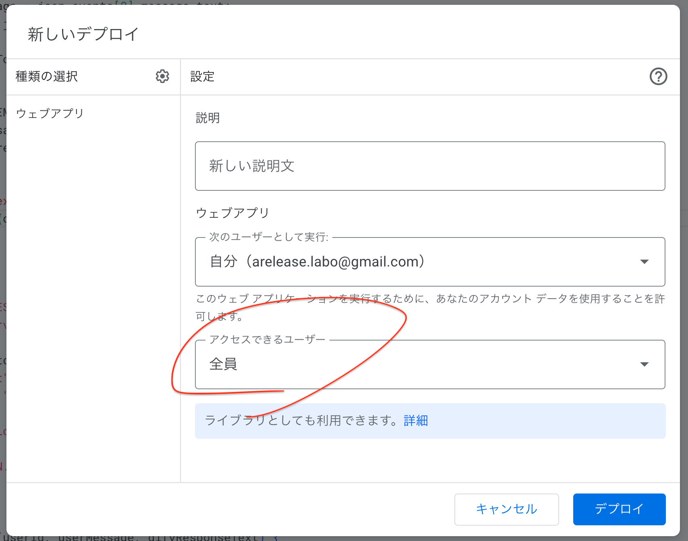
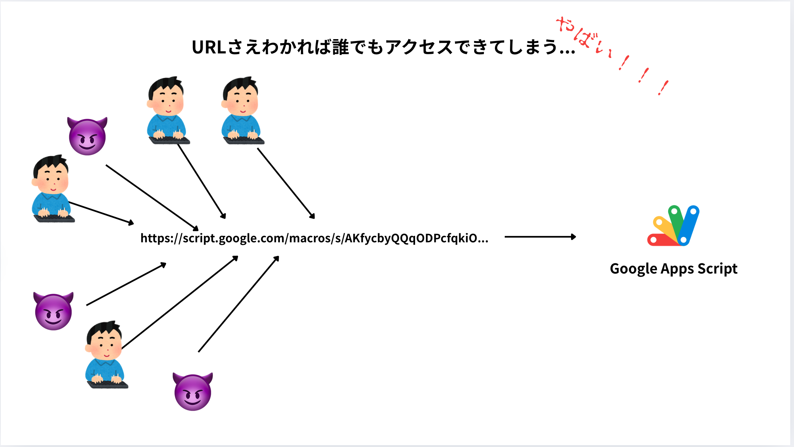
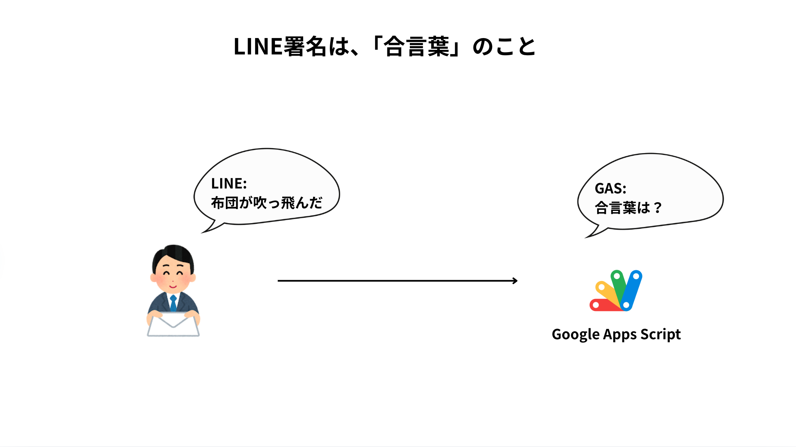
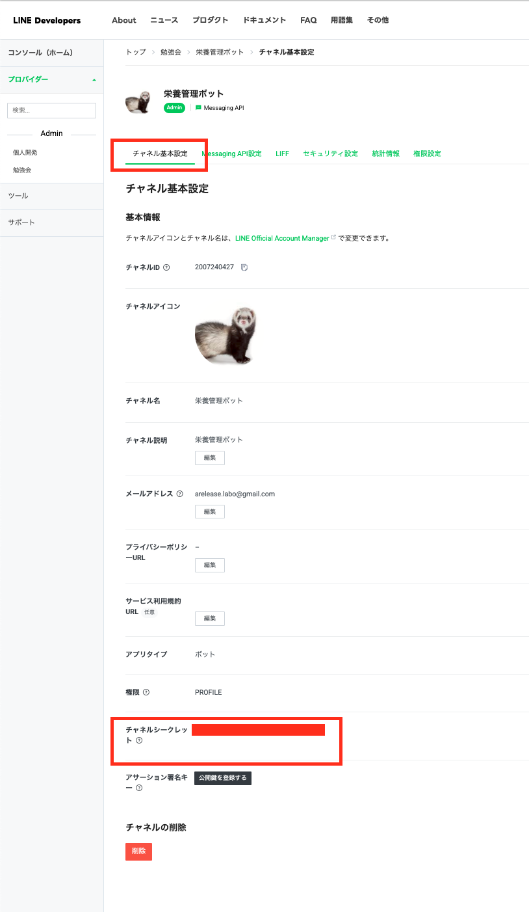
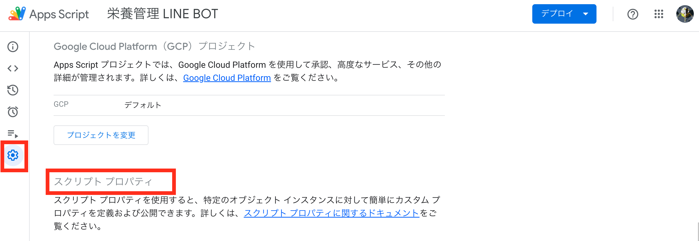

# LINE 署名検証 は合言葉！

> [!WARNING]
> GAS では HTTP ヘッダーにアクセスできないため、この方法が使えない
> https://qiita.com/nnhkrnk/items/581039e07954badd61ed
>
> https://creators-note.chatwork.com/entry/2017/12/20/163128

ドキュメント参照: https://developers.line.biz/ja/docs/messaging-api/receiving-messages/#verify-signature

## なぜ署名検証が必要か？

現状、GAS の URL がわかれば誰でもアクセスできてしまう。



つまり



## そこで用いるのが LINE 署名



## 実装方法

### 1. 署名の検証に必要な情報

- チャネルシークレット（LINE Developers コンソールから取得）
- X-Line-Signature（LINE プラットフォームからのリクエストヘッダに含まれる）
- リクエストボディ（Webhook で受け取る JSON データ）

#### チャネルシークレット



取得したら GAS のスクリプトプロパティに入れる。



#### X-Line-Signature

```

const signature = e.headers["x-line-signature"];

```

#### リクエストボディ

```

const body = e.postData.contents;

```

### 2. GAS での実装例

```javascript
// 署名検証用の関数
function isValidSignature(secret, signature, body) {
  const hash = Utilities.computeHmacSha256Signature(body, secret);
  const computedSignature = Utilities.base64Encode(hash);
  return signature === computedSignature;
}

function doPost(e) {
  const secret = PropertiesService.getScriptProperties().getProperty(
    "LINE_CHANNEL_SECRET"
  );
  const signature = e.headers["x-line-signature"];
  const body = e.postData.contents;

  // 署名を検証
  if (!isValidSignature(secret, signature, body)) {
    // 署名が無効な場合はエラーを返す
    return ContentService.createTextOutput(
      JSON.stringify({
        status: "error",
        message: "Invalid signature",
      })
    ).setMimeType(ContentService.MimeType.JSON);
  }

  // 以降の処理（メッセージ処理など）
  // ...
}
```

## セキュリティのベストプラクティス

1. **チャネルシークレットの管理**

   - スクリプトプロパティを使用して安全に保管
   - コード内に直接記述しない
   - 定期的な更新を検討

2. **エラーハンドリング**

   - 署名検証失敗時は適切なエラーレスポンスを返す
   - エラーログを記録して監視

3. **アクセス制御**
   - GAS のデプロイ設定で適切なアクセス権限を設定
   - 必要最小限の公開範囲に制限

## トラブルシューティング

- 署名検証が常に失敗する場合

  - チャネルシークレットの確認
  - リクエストボディの文字列が正確に取得できているか確認
  - 改行コードの違いによる影響がないか確認

- デプロイ後にエラーが発生する場合
  - GAS の実行ログを確認
  - LINE Developers コンソールでのエラーログを確認
  - Webhook の設定を再確認
